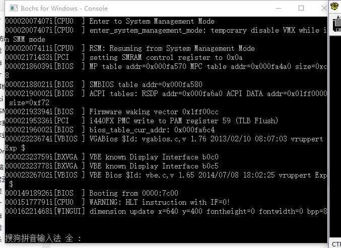
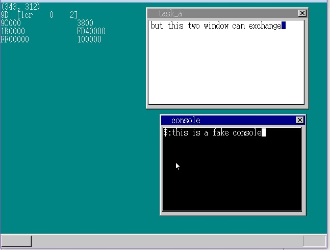

# HowOperationSystem
This is a course project for *Operating System Principle* in Sun Yat Sen University. I developed a toy operating system that supporting graphic user interface and multi-task schedule.

## Code Module
* memory.c: Memory management
* graphic.c, sheet.c: Graphic user interface
* timer.c: Task timer management
* mouse.c, keyboard.c: Mouse and keyboard interruption handler
* mtask.c, fifo.c: Task management
* dtsys.c: GDT, LDT and IDT
* naskfunc.nas: Assembly language functions
* osmain.c: OS entrance file
* howos.asm, mbrnew.asm: boot loader

Please run `make` then we get `howos.sys`, you need to make a rom image using this file. Then run it on VMWare or a real computer.

## Screenshot

